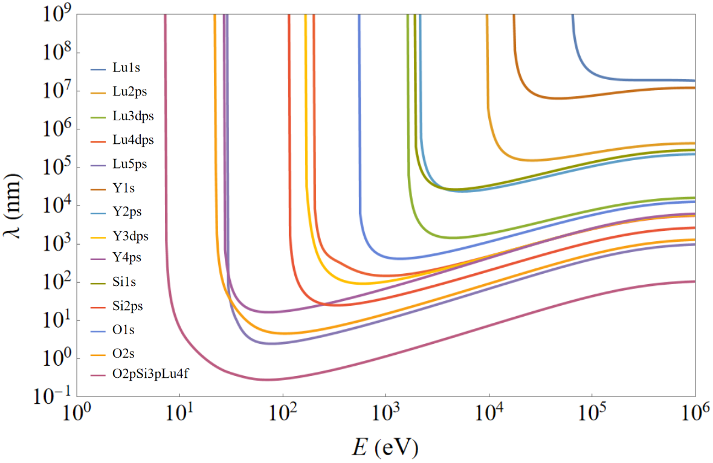
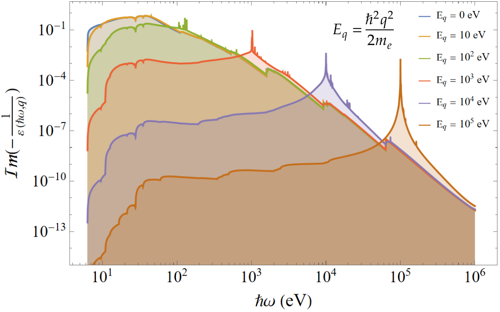

## List of processes

  
   
   

## Inelastic electron scattering

The inelastic mean free path $\lambda_{peh}^{-1}$ for a charge particle in a crystalline material can be obtained using the dielectric permittivity $\varepsilon(\omega,q)$ [1]:

$\lambda_{peh}^{-1}(E) = \frac{2 Z^{2}}{\pi a_{B} m_{e} v^{2}(E)} \int_{0}^{E} d(\hbar \omega) \int_{q_{\text{min}}}^{q_{\text{max}}} \frac{dq}{q} \operatorname{Im}\left(- \frac{1}{\varepsilon(\omega,q)}\right)$,

  
$q_{_{min}^{max}} = \frac{1}{\hbar c} (\sqrt{E(E+2mc^{2})}) \pm \sqrt{(E- \hbar \omega) (E- \hbar \omega + 2mc^{2})}$.

Here, $Ze$ is the particle charge, $a_{B}$ is the Bohr radius for hydrogen, $m_{e}$ is the electron mass, $\hbar$ is the reduced Planck constant, $v(E) = c \frac{\sqrt{E(E+2mc^{2})}}{E+2mc^{{2}}}$ is the particle velocity, $m$ is the particle mass, $c$ is the light velocity.
 
 

  
  <figcaption>Inelastic mean free path for electrons interacting with subshells of LYSO scintillator.</figcaption>

The dielectric permittivity can be calculated using the TDDFT method or the more accurate GW+BSE approach implemented in the Quantum Espresso package [2].
 
 
For ionic crystals imaginary part $\varepsilon_{2}(\omega, 0)$ of the dielectric permittivity can be obtained by using the photoexcitation cross section $\sigma_{i}$ of atomic shells of components presented in the Evaluated Photon Data Library (EPDL97) [3] taking into account the correction of the population $\Delta f_{i}$ and the energy $\Delta E_{i}$ of atomic shells:

  
$\varepsilon_{2}(\omega, 0) = \sum_{i} \varepsilon_{2}^{i}(\omega, 0) = \frac{nc}{\omega} \sum_{i} (f_{i} + \Delta f_{i}) N_{i} \sigma_{i} (\hbar \omega + \Delta E_{i})$.

Here, $n$ is the refractive index, $f_{i}$ is the population of i-th atomic shell, $N_{i}$ is the concentration of i-th-atomic-shell-related element.
 
 
To extrapolate the dielectric permittivity for the case of nonzero $q$, the Generalized Oscillator Strength (GOS) approximation can be used [1]:

  
$\varepsilon_{2}(\omega, q) = \frac{\sqrt{m_{e}}}{2 \sqrt{2} \hbar^{2} \omega q} \sum_{i} \int_{E_{i} + (\sqrt{\hbar \omega - E_{i}} - \frac{\hbar q}{\sqrt{2 m_{e}}})^{2}}^{E_{i} + (\sqrt{\hbar \omega - E_{i}} + \frac{\hbar q}{\sqrt{2 m_{e}}})^{2}} \frac{\hbar \omega'}{\sqrt{\hbar \omega' - E_{i}}} \varepsilon_{2}^{i}(\omega', 0) d(\hbar \omega')$.

The Kramers-Kronig relations can be used to obtain the real part $\varepsilon_{1}(\omega, q)$ of the dielectric permittivity to correct the energy loss function:

  
$\varepsilon_{1}(\omega, q) = 1 + \frac{2}{\pi} \mathcal{P} \int_{0}^{\infty} \frac{\omega' \varepsilon_{2}(\omega', q)}{\omega'^{2}-\omega^{2}} d \omega'$.

  
  <figcaption>Energy loss function in LYSO scintillators.</figcaption>

 

## Auger process

The rate of Auger decay $\tau_{hhe}^{-1}$ ($\sim 10^{15} s^{-1}$) for a core hole can be calculated as follows [4]:

 
$\tau_{hhe}^{-1} = \frac{1}{\pi^{2}} \int d\omega \int d^{3}q \operatorname{Im}\left(- \frac{1}{\varepsilon(\omega,q)}\right) M_{\vec{q}}^{hh}(E, E-\hbar \omega) g_{h}(E-\hbar \omega)$,

with 

 
$M_{\vec{q}}^{hh}(E, E-\hbar \omega) g_{h}(E) g_{h}(E-\hbar \omega) = \frac{V}{q^{2}} \sum_{_{n', \vec{k}'}^{n, \vec{k}}} (|\rho_{n,\vec{k};n,\vec{k}'}|^{2})_{-\vec{q}} \; \delta(E - E_{n'}(\vec{k}')) \, \delta(E - \hbar \omega - E_{n}(\vec{k}))$,

$(|\rho_{n,\vec{k};n,\vec{k}'}|^{2})_{-\vec{q}} = \frac{(2\pi)^{3} e^{2}}{V^{2}} P_{n,\vec{k};n,\vec{k}'} \delta(\vec{q} + \vec{k} - \vec{k}')$,

$P_{n,\vec{k};n,\vec{k}'} = |\int_{v} u_{n,\vec{k}}^{*}(\vec{r}) u_{n',\vec{k}'}(\vec{r})|^{2} d^{3} r$.

Here, $g_{h}(E)$ is the density of states in the valence and core bands of a crystal, $V$ is the crystal volume, $v$ is the volume of the unit cell, $u_{n,\vec{k}}(\vec{r})$ is the periodic part of the Bloch function: $\psi_{n,\vec{k}}(\vec{r}) = \frac{1}{\sqrt{V}} u_{n,\vec{k}}(\vec{r}) e^{i \vec{k} \cdot \vec{r}}$.

## Electron(hole)-phonon scattering

DFT packages such as Quantum Espresso [2] can be used to calculate the carrier-phonon scattering rate with high accuracy for both single crystals and substitutional solid solutions.
 
 
The electron(hole)-phonon scattering rate $\tau_{ph, _{abs}^{em}}^{-1}$ can be evaluated assuming the single parabolic band approximation in the approximations of the Fröhlich polarization and the deformational potential [5]:

 
$\tau_{PLO, s, _{abs}^{em}}^{-1}(E_{k}) = \frac{e^{2} \sqrt{m^{*}} \hbar \Omega_{LO,s}}{4 \sqrt{2} \pi \varepsilon_{0} \hbar \tilde{\varepsilon}_{s}} \frac{1}{E_{k}} (n(\hbar \Omega_{LO, s}) + \frac{1}{2} \pm \frac{1}{2}) \, ln\left(\left| \frac{\sqrt{E_{k}}+\sqrt{E_{k} \mp \hbar \Omega_{LO,s}}}{\sqrt{E_{k}}-\sqrt{E_{k} \mp \hbar \Omega_{LO,s}}} \right|\right)$,

$\tau_{DLA, _{abs}^{em}}^{-1}(E_{k}) = \frac{\sqrt{m^{*}} \sigma_{d}^{2}}{4 \sqrt{2} \pi \hbar c_{L} \rho} \frac{1}{\sqrt{E_{k}}} \int_{0}^{2\frac{\sqrt{2 m^{*} E_{k} \mp c_{L} m^{*}}}{\hbar}} (n(\hbar q c_{L}) + \frac{1}{2} \pm \frac{1}{2}) q^{2} dq$, 

$\tau_{PLA, _{abs}^{em}}^{-1}(E_{k}) = \frac{\sqrt{m^{*}} (k e \beta)^{2}}{4 \sqrt{2} \pi \hbar c_{L} \rho} \frac{1}{\sqrt{E_{k}}} \int_{0}^{2\frac{\sqrt{2 m^{*} E_{k} \mp c_{L} m^{*}}}{\hbar}} (n(\hbar q c_{L}) + \frac{1}{2} \pm \frac{1}{2}) \frac{\lambda^{2}_{TF} q^{2}}{1 + \lambda^{2}_{TF} q^{2}} dq$, 

with 

 
$\beta = 4 \pi \frac{e_{14}}{\varepsilon_{st}}$, $k = \frac{1}{4 \pi \varepsilon_{0}}$, $n(\hbar \Omega) = \frac{1}{e^{\frac{\hbar \Omega}{k_{B} T}}-1}$.

Here, $m^{*}$  is the effective electron(hole) mass, $\Omega_{LO,s}$ is the longitudinal optical phonon frequency, $\varepsilon_{0}$ is the vacuum permittivity, $e$ is the electron charge, $k_{B}$ is the Boltzmann constant, $\tilde{\varepsilon}_{s}$ is the effective dielectric permittivity, $\rho$ is the crystal density, $c_{L}$ is the longitudinal sound velocity, $\sigma_{d}$ is the acoustical deformation potential, $e_{14}$ is the piezoelectric constant, $\varepsilon_{st}$ is the static dielectric permittivity, $\lambda^{2}_{TF}$ is the Thomas-Fermi screening length. 
 
 
The electron(hole)-phonon scattering rate $\tau_{ph, _{abs}^{em}, disorder}^{-1}$ in a substitutional solid solution can be calculated by integrating $\tau_{ph, _{abs}^{em}}^{-1}$ with the semiclassical confining potential $E_{0}(\vec{r})$, which is evaluated using the local landscape method [7]:

 
$\tau_{ph, _{abs}^{em}, disorder}^{-1} = \frac{1}{V} \int_{V} \tau_{ph, _{abs}^{em}}^{-1}(E + \tilde{E}_{0}(\vec{r})) d^{3}r$,

with 

 
$\tilde{E}_{0}(\vec{r}) = E_{0}(\vec{r}) - <E_{0}>_{V}$.

The semiclassical confining potential $E_{0}(\vec{r})$ can be obtained by solving the following equation:

 
$(- \frac{\hbar^{2}}{2 m^{*}_{vc}} + \tilde{u}(\vec{r})) \nu(\vec{r}) = 1$,

$\tilde{u}(\vec{r}) = u(\vec{r}) - min(u(\vec{r}))$,

$E_{0}(\vec{r}) \approx \frac{1}{\nu(\vec{r})} + min(u(\vec{r}))$,

with the periodic boundary conditions

 
$\nu(\vec{r} + \vec{T}_{i}) = \nu(\vec{r})$.

Here, $u(\vec{r})$ is the disorder-induced potential fluctuations in the quasiclassical approximation, $m^{*}_{vc}$ is the electron (hole) effective mass in the virtual crystal.

## Alloy scattering

The alloy scattering rate $\tau_{el}^{-1}$ in crystalline compound can be calculated using the CPA-based method [6]:

 
$\hat{H}_{vc} = x \hat{H}^{AC} + (1-x) \hat{H}^{BC}$,

$\hat{H}_{vc} \ket{\phi_{n,\vec{k}}^{vc}} = \varepsilon_{n}^{vc}(\vec{k}) \ket{\phi_{n,\vec{k}}^{vc}}$,

$\Sigma_{n, \vec{k}}(E) \approx \frac{V}{(2\pi)^{3}} \sum_{n'} \int_{\mathfrak{B}} \frac{\left| \braket{\phi_{n',\vec{k}'}^{vc}}{\hat{u}}{\phi_{n,\vec{k}}^{vc}} \right|^{2}}{E - \varepsilon_{n'}^{vc}(\vec{k}') - \Sigma_{n', \vec{k}'}(E)} d^{3}k'$,

$E_{n}(\vec{k}) = \varepsilon_{n}^{vc}(\vec{k}) + \Sigma_{n, \vec{k}}(E_{n}(\vec{k}))$, 

$\tau_{el}^{-1}(E_{n}(\vec{k})) = \frac{2 \left| Im(E_{n}(\vec{k})) \right|}{\hbar}$.

Here, $\hat{H}_{vc}$ is the virtual crystal Hamiltonian, $\hat{H}^{AC}$ and $\hat{H}^{BC}$ are the Hamiltonians for AC and BC single crystals in the single particle approximation, $\varepsilon_{n}^{vc}(\vec{k})$ are the eigenvalues of the virtual crystal Hamiltonian $\hat{H}_{vc}$, $\ket{\phi_{n,\vec{k}}^{vc}}$ are single particle states of the virtual crystal, $\hat{u}$ is the perturbation operator reflecting the effect of disorder-induced potential fluctuations $u(\vec{r})$, $\Sigma_{n, \vec{k}}(E_{n}(\vec{k}))$ are the matrix elements of the self-energy operator $\hat{\Sigma}$ in the basis of the virtual crystal states $\ket{\phi_{n,\vec{k}}^{vc}}$, $E_{n}(\vec{k})$ is the complex carrier energy.

## e-h interaction

The dynamics of a charge carrier in the field of other carriers and an external electric $\vec{E}$ or magnetic $\vec{B}$ field is described assuming the quasiclassical approximation as follows:

 
$\frac{d \vec{p}_{i}}{dt} = \sum_{j \neq i} \frac{k q_{i} q_{j}}{\varepsilon_{st} \left| \vec{r}_{i} - \vec{r}_{j} \right|^3} (\vec{r}_{i} - \vec{r}_{j}) + q_{i} (\vec{E} + \vec{v}_i \times \vec{B})$

Here, $\vec{p}_{i}$ and $\vec{v}_{i}$  are the momentum and velocity of ith charge particle, respectively, whereas $q_{i}$ is its charge.
A certain electron-hole pair is considered to be recombined into an exciton at a certain step of the simulation if the following condition is satisfied:

 
$\Delta E_{ij} = E_{k,i} + E_{k,j} + \frac{k q_{i} q_{j}}{\varepsilon_{st} \left| \vec{r}_{i} - \vec{r}_{j} \right|} - E_{k,ij}^{c}$

where $E_{k,i}$ and $E_{k,j}$ are the kinetic energies of ith and jth carriers, respectively, whereas $E_{k,ij}^{c}$ is the kinetic energy of them center of mass. 
The electron-hole or exciton recombination into a photon is described by empirical parameters.

## Exciton decay

## Excitation capture and transfer

The black-capture-sphere model can used to estimate the probability of carrier capture by emission centers [4].
 
 
The excitation transfer rate $w_{T_{1} \rightarrow T_{2}}$ from donor $T_{1}$ to acceptor $T_{2}$ separated by the distance $r$ is calculated as follows [8]: 

 
$w_{T_{1} \rightarrow T_{2}} = \frac{1}{\tau_{T_{1}}} \frac{R^{6}_{d-d, T_{1} \rightarrow T_{2}}}{r^{6}} + c_{T_{1} \rightarrow T_{2}} e^{-2 \frac{r}{\alpha_{T_{1} \rightarrow T_{2}}}}$,

where $\tau_{T_{1}}$ is the emission decay time of donor state $T_{1}$, $R_{d-d, T_{1} \rightarrow T_{2}}$ is the dipole-dipole transfer radius between donor state $T_{1}$ and acceptor state $T_{2}$, $\alpha_{T_{1} \rightarrow T_{2}}$ is the Dexter transfer radius, and $c_{T_{1} \rightarrow T_{2}}$ is the frequency factor.

## Activation center decay 

Usually the decay time of a certain activation center in a certain matrix host can be obtained experimentally and then used for general simulation.

## Light propagation and absorption