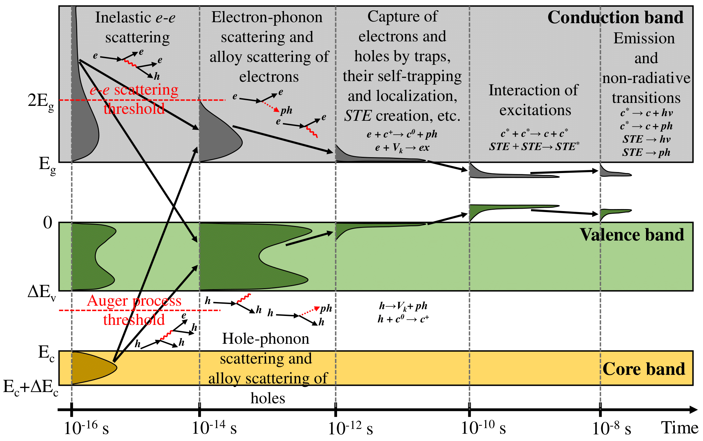

# Here the description of particle processes is provided

# List of processes

  

# Inelastic electron scattering
The inelastic mean free path $\lambda_{peh}^{-1}$ for a charge particle in a crystalline material can be obtained using the dielectric permittivity $\varepsilon(\omega,q)$ [1]: 

$$\lambda_{peh}^{-1}(E) = \frac{2 Z^{2}}{\pi a_{B} m_{e} v^{2}(E)} \int_{0}^{E} d(\hbar \omega) \int_{q_{min}}^{q_{max}} \frac{dq}{q} \operatorname{Im}(- \frac{1}{\varepsilon(\omega,q)})$$
